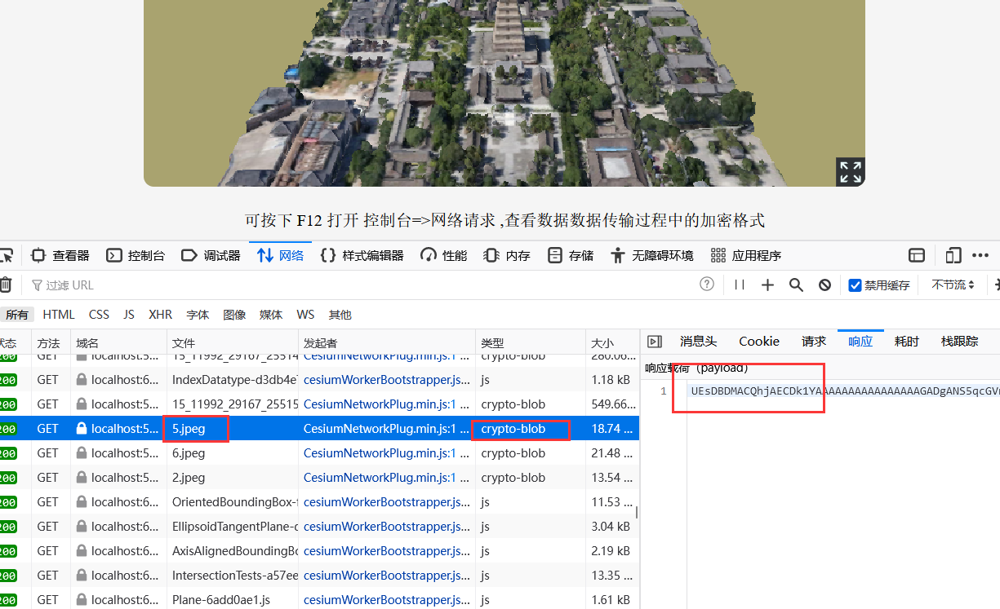

关键词：Cesium、IndexDB、Data Encryption、浏览器缓存、网络传输、数据加密


## 一、项目简介

**CesiumNetworkPlug.js** 是一个为 Cesium 开发的 **数据传输功能** 拓展插件，具备以下两个核心功能


### 1、浏览器缓存

模块名：OfflineCacheController

简介：增加对浏览器本地缓存的支持，它使用 **indexDB** 离线缓存技术管理 影像图层、地形、3DTiles模型 等资源数据。

原理：在 Cesium 发送 **资源请求**（图层、地形、模型）前，判断本地是否有缓存存在，如果存在则优先使用本地缓存，本地缓存策略能 **极大提升** 场景的二次加载速度。

### 2、数据加密

模块名：DecryptionController

背景：部署在公网的云服务器的 Cesium WebGIS 项目时常面临着严重的数据安全威胁。如果没有做好安全措施，不怀好意的第三方开发者只需要写一个简单的爬虫，就能把 Web 服务器中的 **3DTiles**、**高精度影像图层**、**地形数据**、**矢量数据** 等静态资源全部 Download 走！

简介：配合服务端的 Cesium  数据加密传输的插件，将静态资源数据在服务端通过加密算法生成为加密格式，再传输给客户端；前端根据密码自动解密复为原始数据。

原理：如需要使用本功能，需要按以下两个步骤进行操作

- NodeJs 服务端

  本仓库提供了用于数据加密的库，可在 Web服务器中将数据加密后返回 http 请求，示例代码可看下文

- 浏览器端

  引入后，配置好密码即可自动用于对资源路径请求进行代理，并解密。


## 二、使用方式

### 1、链接地址

- 在线体验：http://101.43.223.126:5000/
- 插件下载
  - 完整包：http://101.43.223.126:5000/CesiumNetworkPlug/dist/CesiumNetworkPlug.min.js
  - 加解密函数库：http://101.43.223.126:5000/CesiumNetworkPlug/dist/CryptoUtil.min.js
- 离线 Demo下载：http://101.43.223.126:5000/Release.rar


### 2、Web 端

引入插件：

```html
<!-- 需要提前将 Cesium 库引入 -->
<script src="./lib/Cesium/^1.103/Cesium.js"></script>
<link rel="stylesheet" href="./lib/Cesium/^1.103/Widgets/widgets.css">
<link rel="stylesheet" href="./css/main.css">

<!-- OfflineCacheController 的实现依赖 localforage 第三方库-->
<script src="./lib/localforage/localforage.min.js"></script>

<!-- 正式引入插件！ -->
<script src="./lib/CesiumNetworkPlug/dist/CesiumNetworkPlug.min.js"></script>


<!-- 使用插件 -->
<script>
    // 添加数据解密规则,参数一：url匹配路径；参数二：用于解密的密码
    const DecryptionController= CesiumNetworkPlug.DecryptionController;
	DecryptionController.ruleMap.set("http://localhost:5000/", "@mtJQGyEEq6DBK.hxVR*3fTGgXssxCfMtZQEyUTF");
    
    // 添加 IndexDB 缓存规则
    const OfflineCacheController= CesiumNetworkPlug.OfflineCacheController;
    // ① 全局缓存
    // OfflineCacheController.ruleList.add('*');
    // ② 对指定地址的 瓦片图层 缓存
    // OfflineCacheController.ruleList.add('http://localhost:5000/MapBox-Tile/');
    // ③ 对 OSM 电子地图缓存
    // OfflineCacheController.ruleList.add('https://c.tile.thunderforest.com/');
    // ③ 对指定地址的 3DTile 缓存
    // OfflineCacheController.ruleList.add('http://xxx.xx.xx.xx:3000//3DTiles/');
</script>
```


### 3、NodeJS 服务端

> 注意！服务端的运行环境必须是 **NodeJS V18.0** 以上

```js
const fs = require("fs");
const path = require("path");
const CryptoUtil = require("./lib/CesiumNetworkPlug/dist/CryptoUtil.min.js");

async function test() {
    const fileName = "浙江省.geojson";
    const buffer = fs.readFileSync(path.join(__dirname, "../www/" + fileName));
    const blob = new Blob([buffer]);

    const [encryptErr, encryptBlob] = await CryptoUtil.encryptByBlob(blob,  "@mtJQGyEEq6DBK.hxVR*3fTGgXssxCfMtZQEyUTF", fileName, false);
    const encryptBuffer = Buffer.from(await encryptBlob.arrayBuffer());

    fs.writeFileSync(path.join(__dirname, fileName), encryptBuffer);
}
```


## 三、API 文档

命名空间：`window.CesiumNetworkPlug.*`

- **CesiumNetworkPlug**

```js
const CesiumNetworkPlug = {
    DecryptionController,
    OfflineCacheController,
    CryptoUtil: DecryptionController.CryptoUtil
};
```


- DecryptionController（Web端解密规则控制器）

```js
const DecryptionController = {
    ruleMap: new Map(),
    // 判断该资源项是否需要解密
    judgeUrl(judgeUrl:string) {
        return {needDecode:boolean, decodePassword:string};
    },
    CryptoUtil:CryptoUtil
};
```


- **OfflineCacheController**（Web端数据缓存规则控制器）

```js
const OfflineCacheController = {
    // 缓存规则
    ruleList: new Set(),
    // 判断该资源项是否符合缓存规则
    judgeUrl(url) {},
    async keys() {},
    async clear() {},
    // 计算缓存占用的存储空间大小
    async getUseSize() {}
};
```


- **CryptoUtil（加密、解密工具类）**

```js
const CryptoUtil = {
    async encryptByBlob(blob, password, fileName, debug = false) {
          return [encryptedErr, encryptedBlob];
    },
    async decryptByBlob(blob, password, debug = false) {
          return [encryptedErr, encryptedBlob];
    },
    async decryptByUrl(url, password, debug = false) {
          return [encryptedErr, encryptedBlob];
    },


    async decryptFirstFileBlob(encryptedBlob, password, debug = false) {
          return [decryptedErr, blob];
    },
    async decryptFirstFileByUrl(url, password, debug = false) {{
          return [decryptedErr, blob];
    },


    async blobToText(blob) {
          return [err, text];
    },
    async blobToJson(blob) {
          return [err, json];
    },
    async blobToArrayBuffer(blob) {
          return blob.arrayBuffer();
    }
};

```


## 四、拓展说明：数据加密

业界主流主要是采用以下几种方案，这几个方案可进行组合使用：


### 1、拒绝跨域访问

安全性：:star:

数据直接放在Web服务器下，拒绝跨域访问资源。

- 缺点：这个安全性最低！第三方程序员只需要写一个请求转发的后端程序，就能直接盗用资源数据。


### 2、携带资源访问令牌

安全性：:star::star:

这个是绝大部分在线地图商采用的方案，服务端要求客户端在请求头中携带资源访问令牌，即 Token ，并允许跨域访问。

- 缺点：Token 极易泄露！例如 天地图影像、MapBox影像、Ceisum 官方地形数据，都采用的这种方式，开发者者打开浏览器控制台，盗走 Token 轻而易举。


### 3、资源访问权限拦截

安全性：:star::star::star:

检查当前用户是否登录，如果为未登录则拒绝资源请求 URL。

例如：开发后台服务程序，使用 Session 会话机制检查当前用户是否登录，如果为未登录则拒绝资源请求 URL。该方案实际上是检查资源请求头中的 Session ID，能灵活对用户账号的权限做判断，**安全性有明显提升**。

- 缺点：
  - 但如果攻击者有业务系统的合法账号，数据仍有被爬虫盗取的可能。
  - 需要编写的后台服务的代码量比较大。
  - 这个方案与 Token 的 HTTP 无状态设计理念相悖


### 4、定义一套数据交互格式

安全性：:star::star::star::star::star:

一劳永逸法！自己创建一套数据格式，并写数据解析库来支持数据上球。

缺点：

- 开发量非常大，并且数据接口无法共享


## 五、其他说明

作者 QQ：2394837320

模块内置授权模块，试用期到 2023年09月1日，如有意愿可联系作者购买源码


**Q&A**

1. 这个插件收费吗？

   回答：使用不收费，可以联系作者买源码。

   里面写了日期的许可，但代码仅仅做了压缩，没有做混淆加密。~~如果你执意要白嫖，那么没关系，找到代码里许可的位置，移除掉它就行。~~

   

2. 使用了 indexDB，页面加载速度就一定会提升吗？

   回答：不一定！只有三维倾斜模型资源的体积比较大，且网络带宽低于 15M 时才会有明显的提升。

   

3. 数据加密模块是怎么使用的？

   回答：可看示例代码，这里有写了如何对数据进行加密、解密。

   而在项目中使用，需要对数据进行提前加密，否则服务器负担会较大。

   

4. 使用了数据加密模块后，性能如何页面载入会变慢吗？

   回答：会有轻微的影响！对 1Mb 的文件进行解密，耗时约为 100ms。

   最佳实践：

   - 数据可预先加密好，将资源包放到 https://github.com/WangShan010/SQLiteFileMana 
   - 数据加密模块配合数据缓存模块使用，二次加载的体验会有很大的提升

   

5. 这是怎么加密的，会不会存在安全问题？

   回答：用的是 AES 算法。

   

6. 我调试 OfflineCacheController 缓存模块的时候，好像出 bug 了怎么清空缓存？

   回答：打开控制台=>存储=>indexed DB 右键清空，或者在控制台输入指令：```CesiumNetworkPlug.OfflineCacheController.clear()```

   

7. 加密服务和前端插件都配置好了，我怎么知道我的数据已经被加密好了了？

   回答：很简单，用 FireFox 浏览器打开控制台=>网络请求，查看 Cesium 发出的请求，比如图层图片、3DTiles、geojson 等，你会发现返回类型是一个很奇怪的格式【crypto-blob】，并且是 UEsDBDMACQhj 开头的一个二进制流。

   这个数据可以通过 CesiumNetworkPlug 插件，根据密码进行自动解密。

   即便别人把数据爬走也不可使用！

   

   


